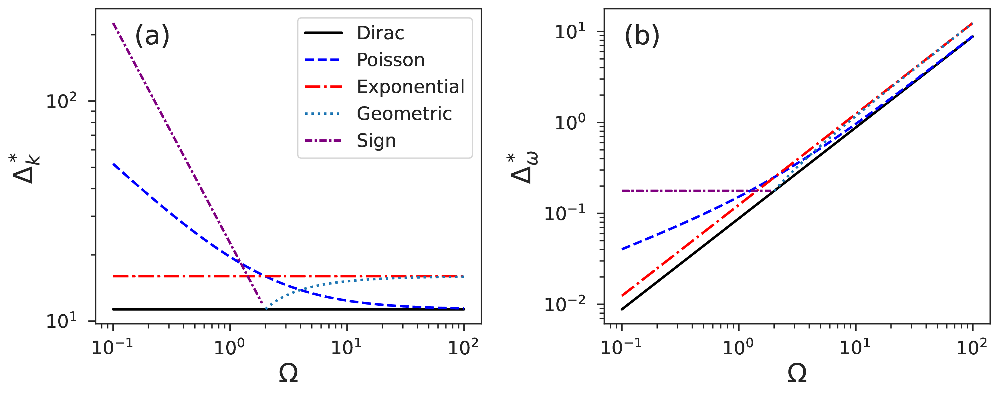
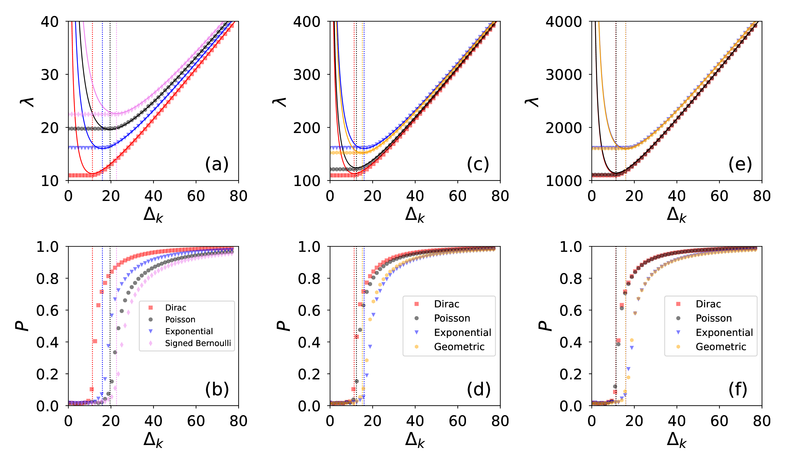
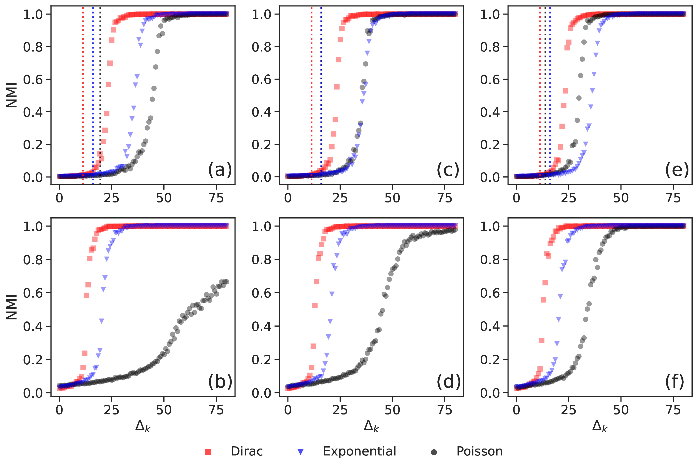

<!-- _class: title -->

# The Cocktail Party Problem for Networks

## When Correct Information Hurts Community Detection

Sadamori Kojaku
with Filippo Radicchi, Filipi N. Silva, Alessandro Flammini, Santo Fortunato

NetSci 2026

---

<!-- _class: title -->

# A Cocktail Party

*You can follow one conversation in a crowded room.*

*Now imagine a second voice, equally clear, speaking on an unrelated topic at the same volume.*

*Comprehension collapses.*

*The second voice is not noise. It is signal you do not want.*

---

# The Paradox in One Slide

Community detection should improve when we add more data. Right?

Today I will show three things.

- **Correlated weights** make detection easier
- **Irrelevant weights** make detection harder. There is a tax.
- **Ignoring irrelevant weights** can be mathematically optimal

The second voice is not lying. It is just irrelevant. And that is enough to break detection.

---

# A Clean Benchmark: Two Scenarios

Weighted Planted Partition Model. Two equal blocks.

|                     | Communities in **topology** | Communities in **weights** |
|---------------------|:---------------------------:|:--------------------------:|
| **Scenario A**      | signal                      | noise                      |
| **Scenario B**      | noise (Erdos-Renyi)         | signal                     |

Five weight distributions: **Dirac, Poisson, Exponential, Geometric, Signed Bernoulli**.

We did not cherry-pick. We swapped where the signal lives.

---

# Building the Modularity Matrix

For a weighted graph with adjacency $a_{ij}$ and weights $w_{ij}$,

$$
q_{ij} = a_{ij} w_{ij} - \frac{s^{(i)} s^{(j)}}{2 m_w}
$$

Node strength: $s^{(i)} = \sum_j a_{ij} w_{ij}$. Total weight: $2 m_w = \sum_i s^{(i)}$.

- First term: **what we observe**, a weighted edge
- Second term: **what we would expect at random**, given node strengths

Community structure lives in the gap between observation and the random null.

---

# From $Q$ to $\Delta s$: Row Sums Tell the Story

Sum row $i$ of the modularity matrix over nodes in community 1:

$$
\sum_{j \in C_1} q_{ij} = \underbrace{\sum_{j \in C_1} a_{ij}w_{ij}}_{s^{(i)}_{\text{in}}} - \frac{s^{(i)} \sum_{j \in C_1} s^{(j)}}{2 m_w}
$$

$s^{(i)} = \sum_j a_{ij} w_{ij}$ is the strength of node $i$. The denominator $2 m_w = \sum_{\text{all nodes}} s^{(r)}$ is twice the total edge weight.

For two equal-sized communities the total strength splits evenly, so $\sum_{j \in C_1} s^{(j)} \approx m_w$, and the null term reduces to $\tfrac{1}{2} s^{(i)}$:

$$
\sum_{j \in C_1} q_{ij} \approx s^{(i)}_{\text{in}} - \tfrac{1}{2} s^{(i)} = \tfrac{1}{2}\,\Delta s^{(i)}
$$

The modularity matrix, applied to a balanced bi-partition indicator, **returns the strength differential**.

---

# Where Does $\lambda$ Come From? (1/3)

Apply $Q$ to the signed indicator $u_j = +1$ for $j \in C_1$, $u_j = -1$ for $j \in C_2$:

$$
(Q\mathbf{u})_i = \sum_{j \in C_1} q_{ij} - \sum_{j \in C_2} q_{ij} = \Delta s^{(i)}
$$

Using the row-sum identity from the previous slide and the fact that $Q$'s rows sum to zero.

So $\mathbf{u}$ is **approximately an eigenvector** of $Q$, and the true principal eigenvector $\mathbf{v}$ inherits its structure:

$$
v_i \propto \Delta s^{(i)}
$$

A node's "vote" is **how much more it interacts with its own side than the other**, measured in strength.

---

# Where Does $\lambda$ Come From? (2/3)

Eigenvalue equation, node by node:

$$
\lambda \, v_i = (Q\mathbf{v})_i
$$

We have two pieces:

- $v_i \propto \Delta s^{(i)}$ from the row-sum argument
- $(Q\mathbf{v})_i$ is, on average, the **typical scale of $\Delta s^2$** (a node weighted by its own differential)

Dividing and averaging over the ensemble (Radicchi, PRE 2013):

$$
\boxed{\;\lambda = \frac{\langle \Delta s^2 \rangle}{\langle \Delta s\rangle}\;}
$$

The eigenvalue **is** a ratio of strength-differential statistics.

---

# Where Does $\lambda$ Come From? (3/3)

$$
\lambda = \frac{\langle \Delta s^2 \rangle}{\langle \Delta s\rangle}
$$

Read this as a **signal-to-noise statement**.

- Numerator $\langle \Delta s^2 \rangle$ contains the spread. Includes random fluctuations of the strengths.
- Denominator $\langle \Delta s\rangle$ is the planted gap. The signal we want to recover.

When the random bulk of the spectrum overtakes $\lambda$, the planted partition is invisible. That crossing point is the **detectability threshold**.

---

# One Formula to Rule Them All

Parametrize the second moment of any weight distribution as

$$
\langle w^2 \rangle = \alpha_0 + \alpha_1 \langle w \rangle + \alpha_2 \langle w \rangle^2
$$

Define the **noise budget**

$$
C = 4\alpha_0 + 2 W \alpha_1 + W^2 \alpha_2
$$

Then the detectability threshold (Scenario A) is

$$
\Delta_k^* = \frac{\sqrt{K\,C}}{W}
$$

Three numbers per distribution. One constant. One threshold formula.

---

# The Cheat Sheet

| Distribution      | $(\alpha_0,\alpha_1,\alpha_2)$ | $C$            | $\Delta_k^*$           |
|-------------------|:------------------------------:|:--------------:|:----------------------:|
| **Dirac**         | $(0,0,1)$                      | $W^2$          | $\sqrt{K}$             |
| **Poisson**       | $(0,1,1)$                      | $W^2 + 2W$     | $\sqrt{K(1+2/W)}$      |
| **Exponential**   | $(0,0,2)$                      | $2 W^2$        | $\sqrt{2K}$            |
| **Geometric**     | $(0,-1,2)$                     | $2W^2 - 2W$    | $\sqrt{2K(1-1/W)}$     |
| **Signed Bern.**  | $(1,0,0)$                      | $4$            | $2\sqrt{K}/W$          |

---

# The Magic Trick

Plug in **Dirac**: $C = W^2$, so $\Delta_k^* = \sqrt{K}$.

This is **exactly the classical unweighted threshold**.

Now plug in **Exponential**: $C = 2W^2$, so $\Delta_k^* = \sqrt{2K}$.

The exponential penalty is **exactly $\sqrt{2}$**.

Not a simulation artifact. Not an empirical fit. The variance of the exponential equals the square of its mean, and that ratio falls straight out of the algebra.

*This is the Stroop effect for networks. Irrelevant but correct information has a measurable, predictable cost.*

---

<!-- _class: figslide -->

# Results: The Hierarchy

Easiest (floor): **Dirac**, flat at $\sqrt{K}$. Hardest (ceiling): **Exponential**, flat at $\sqrt{2K}$.

Interesting: **Poisson** — small $W$: worse than exponential; large $W$: drops to Dirac.
The threshold curves are **predictions**, not fits.

---

<!-- _class: figslide -->

# Phase Transition, Located Exactly

Top row: eigenvalue $\lambda$ vs $\Delta_k$. Bottom row: order parameter $P$ vs $\Delta_k$. Dotted vertical lines mark **analytical thresholds**. The order parameter collapses where we predict. Not a metaphor — a phase transition with a known critical point.

---

<!-- _class: figslide -->

# Beyond Spectral: Leiden Agrees

"Fine, but who uses spectral modularity in practice?" — Leiden algorithm for $q = 2$ (top) and $q = 16$ (bottom) communities. Same hierarchy: Dirac easiest, Exponential hardest, Poisson intermediate. The result is fundamental to the **problem**, not the method.

---

# The Mic Drop

Before running community detection on a weighted network, ask one question:

> Do my weights know about my communities?

- **Yes**: use them. They lower the barrier.
- **No**: **ignore them**. Binarize the network. Run unweighted modularity.
- **Don't know**: test both. The weighted version may be shooting itself in the foot.

In network science, sometimes ignorance is not just bliss. It is **mathematically optimal**.

---

<!-- _class: title -->

# Thank You

**Paper**: arXiv:2511.00214

skojaku@binghamton.edu

*Remember the $\sqrt{2}$. It is the price of exponential randomness.*
